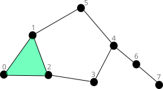

# Analysis of the inference of ratings and rankings on Higher Order Networks with complex topologies

:page_facing_up: **[Paper]()** | :page_facing_up: **[arXiv](https://arxiv.org/abs/2411.02434)** | :paperclip: **[Docs]()** | :computer: **[Tutorials]()** | :floppy_disk: **[Data]()** | :bug: **[Report bug](https://github.com/jipphysics/hon-ranking/issues)** | :email: **[Reach us](juan.perotti@unc.edu.ar)**
